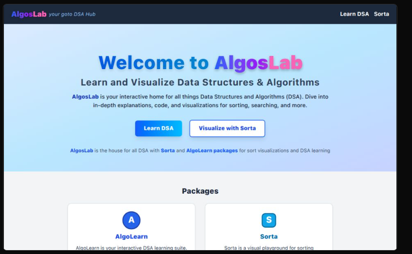

# AlgosLab 

## Sorta

Sorta is your interactive learning area for Data Structures and Algorithms (DSA). Explore in-depth explanations, code examples, and visualizations for sorting, searching, and a wide range of DSA concepts. Perfect for students, educators, and anyone curious about how algorithms work!

## AlgoLearn 

A beginner fiendly digital learning platform for user to learn Data structures and Algorithms; with great explanations and visual. Additional Typescript Guide from beiginer to Advanced concepts to get you coding in less than a day.

If well utilised, AlgoLearn provides a full roadmap for any one to master DSA concepts.